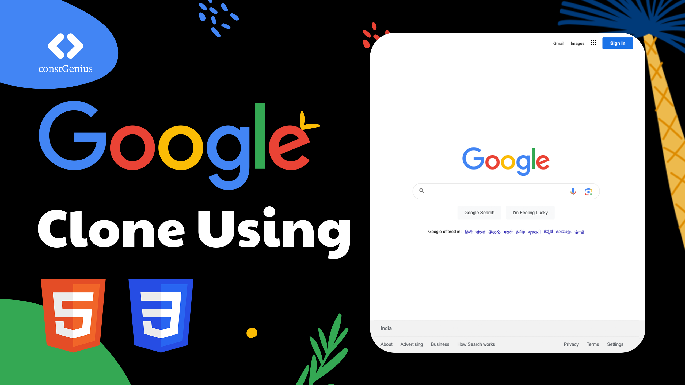

# Google Clone Using HTML CSS | Google Home Page Clone | HTML CSS Project

A Google home page clone using HTML and CSS is a simplified recreation of the iconic Google search engine's front page. It mimics the familiar Google logo, search bar, and buttons, capturing the design essence of the original page. While lacking Google's advanced search functionality, it serves as an educational exercise to practice web development skills, including HTML structure, CSS styling, and basic JavaScript interactions. Creating a responsive and visually accurate clone provides hands-on experience in web design and layout while paying tribute to one of the most recognized websites on the internet.

Youtube Tutorial Link: https://youtu.be/wkH59Bp7-t4

Live Preview: https://constgenius.github.io/GoogleCloneHTMLCSS/

